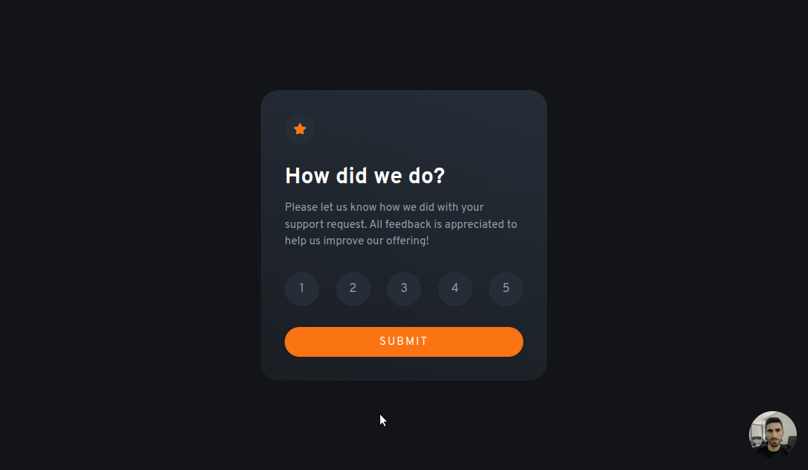
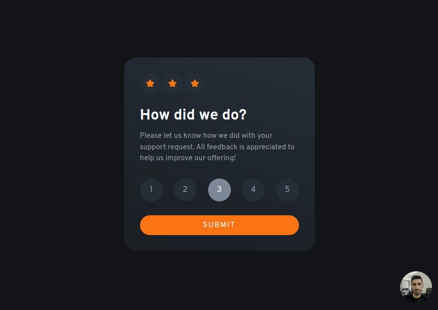

# Frontend Mentor - Interactive rating component solution

This is a solution to the [Interactive rating component challenge on Frontend Mentor](https://www.frontendmentor.io/challenges/interactive-rating-component-koxpeBUmI). Frontend Mentor challenges help you improve your coding skills by building realistic projects.

### Desktop Gif

### Screenshot

### Built with

- React - JS library
- Tailwind CSS - JS library
- CSS custom properties

### The challenge

Users should be able to:

- View the optimal layout for the app depending on their device's screen size
- See hover states for all interactive elements on the page

### Links

- Solution URL: [Github Repo](https://github.com/vaaakoo/React-Interactive-raiting-component)
- Live Site URL: [Live Demo](https://react-interactive-raiting-component.vercel.app/)
